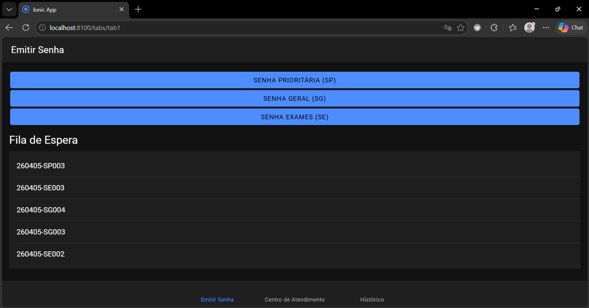
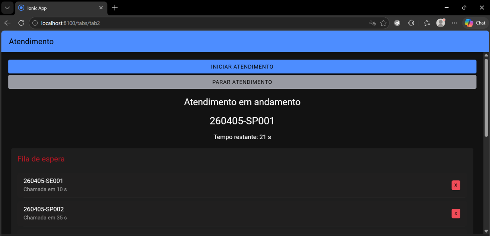
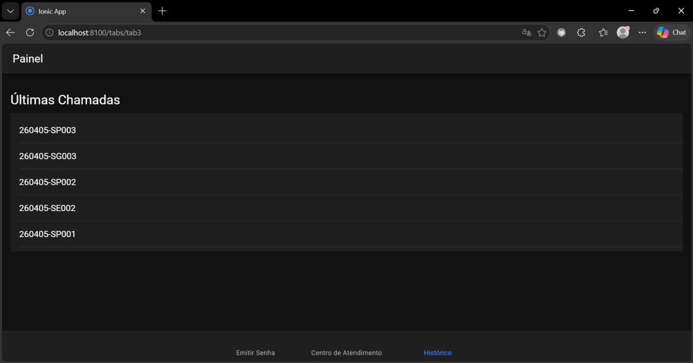

# 📱 MobileTicketsIonic

# 📌 Descrição
O MobileTicketsIonic é um aplicativo desenvolvido com Ionic + Angular para simular um sistema de gerenciamento de filas em laboratórios médicos. O sistema permite a emissão de senhas, controle de atendimento e visualização do histórico, respeitando regras de prioridade e tempo médio de atendimento.

# ⚙️ Tecnologias

* Ionic Framework
* Angular
* TypeScript
* Capacitor

# 🎯 Funcionalidades

✔ Emissão de senhas:

* SP (Prioritária)
* SG (Geral)
* SE (Exames)

✔ Sistema de filas com prioridade:

* SP → maior prioridade
* SE → média prioridade
* SG → menor prioridade

✔ Atendimento automático:

* Tempo variável por tipo de senha
* Chamada automática

✔ Centro de Atendimento:

* Alerta com número da senha
* Tempo restante
* Som ao chamar senha

✔ Fila de espera:

* Tempo estimado por senha
* Exclusão de senha (emergência)

✔ Histórico:

* Últimas 5 senhas chamadas

---

## 🖼️ Imagens do Sistema

### Emitir Senha

### Centro de Atendimento

### Histórico

# 🚀 Como executar

bash
npm install
ionic serve

# 📄 Licença
Este projeto está sob a licença MIT.